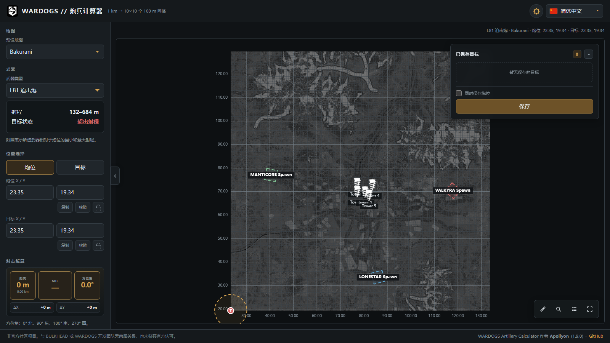

# WARDOGS 炮兵计算器 · 单文件版

**一个 HTML 文件 = 完整的地图 + 炮兵计算器。** 双击用浏览器打开就能用：
不需要联网、不需要服务器、不需要安装任何东西。

## 这个仓库是「离线版」

目标很明确：**断网也能算炮**。把文件拷进 U 盘、丢到群里、塞进平板，双击就能用，
不依赖任何外部服务，也不需要在比赛/训练时祈祷网络稳定。

需要**在线**功能（联机大厅、等高线图层、Terrain3D 高程修正、彩色地图）请用上游原版
[wardogs-artillery.com](https://wardogs-artillery.com/) —— 那些功能依赖服务端，本版本刻意不带。
想自己定制，则用本仓库 `source` 分支自行构建。

## 下载哪个

| 文件 | 大小 | 影像精度 | 适合 |
| --- | --- | --- | --- |
| [`炮兵计算器-单文件版-5MB.html`](炮兵计算器-单文件版-5MB.html) | **4.73 MB** | 全图 z0–z2，塔楼 ±1 km 交战区 z3–z6 | 日常用、发给队友（推荐） |
| [`炮兵计算器-单文件版.html`](炮兵计算器-单文件版.html) | **31.02 MB** | 全图 z0–z4，塔楼 ±1.5 km 交战区 z5–z7 | 想让全图都清晰一点 |

点文件名进入后选 **Download raw file**，或 `Code → Download ZIP` 拿整包。

## 怎么用

1. 下载 `.html` 文件；
2. 双击打开（Chrome / Edge / Firefox 都可以），或直接拖进浏览器窗口；
3. 用完关掉页面就行 —— 没有后台进程，也不写注册表。

> **断网可用**：地图影像、界面、12 种语言全部内嵌在这一个文件里。实测在屏蔽所有域名解析
> （`--host-resolver-rules=MAP * ~NOTFOUND`）的情况下正常打开、缩放、算射击诸元，外部请求数为 0。

## 操作

| 操作 | 效果 |
| --- | --- |
| **鼠标右键** 按下/拖动地图 | 设置/拖动**炮位**（不会弹出浏览器菜单） |
| **鼠标左键** 拖动地图 | 设置/拖动**目标**（点塔楼等预设标记可直接把它设为目标） |
| **空格 + 左键拖动**，或**中键拖动** | 平移地图 |
| 滚轮 | 以光标为中心缩放 |
| `W` `A` `S` `D` / 方向键 | 平移（按住 `Shift` 加速） |
| 拖动左侧栏右边缘 | 自定义侧栏宽度（双击把手恢复默认 290 px） |
| 左侧栏坐标输入框 | 直接输入坐标；炮位/目标都支持复制、粘贴、锁定 |

## 功能

- **三张地图**：Bakurani / Ozeti / Zestafona，另可自定义尺寸
- **两种武器**：L81 迫击炮、SPH-2（距离 / 方位角 / MIL，LOW·HIGH 双解，含射程状态提示）
- **12 种语言**：默认跟随浏览器语言，随时可切换（单文件里是原地切换，不跳转地址）
- 保存目标、测距尺、坐标搜索、图层开关、地图全屏
- 所有偏好与保存目标只存在浏览器本地（localStorage），不上传任何数据

**不含**：彩色地图、等高线、地形高程修正、联机大厅、反馈表单、访问统计、画图标注、导入导出、今日消息。

## 说明

- 地图影像是**灰度 JPEG**（为了压体积）：交战区最清晰，离交战区越远越模糊 ——
  拿不准位置时建议直接用坐标输入框核对。
- 保存的目标与设置存在浏览器里，换浏览器或清缓存会丢。
- 手机浏览器也能打开，但用的是桌面界面（本版本没有 `/mobile/` 路由）。
- 本仓库不开 GitHub Pages：在线使用请走上游原版，这里只做离线分发。
  每次重新构建会把新的 HTML 提交进历史（单个约 5–31 MB），更新频繁的话
  建议改用 Releases 挂附件，只留 README 在仓库里。

## 来源与许可

本项目是 **[apollyon-sys/wardogs-calculator](https://github.com/apollyon-sys/wardogs-calculator)**（MIT）的
**单文件打包版**：把上游应用的样式、脚本、地图配置、标记图标与地图瓦片全部内嵌进一个 HTML，
并按“离线分发”做了精简与调整（去掉需要联网的联机/统计等部分；右键改为放炮位、空格拖动平移、
侧栏可拖宽；语言改为原地切换；页脚只保留仓库链接）。

- 上游代码许可为 **MIT**（见 [LICENSE](LICENSE)），本仓库保留原始许可证与署名。
- WARDOGS 及第三方素材版权归其各自所有者；本项目是**非官方**社区工具，
  与 BULKHEAD / WARDOGS 开发团队无隶属关系。
- 想自己重新打包（改精度、改交战区范围、改语言）：完整源码与打包脚本在本仓库的
  **`source`** 分支 —— 需要 Node.js 18+、Python 3 + Pillow，以及上游的瓦片镜像。
